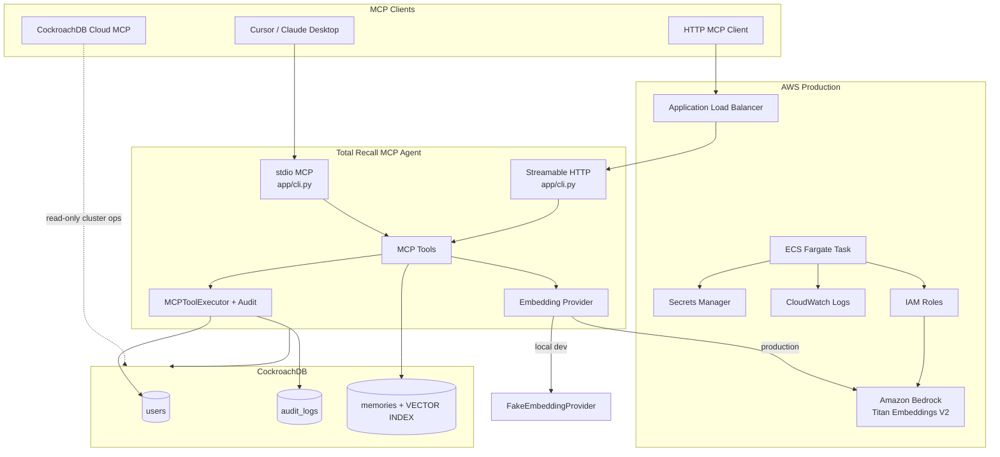

# Total Recall MCP — CockroachDB × AWS Hackathon

**Build the Future of Agentic Memory**  
Hackathon: [cockroachdb-ai.devpost.com](https://cockroachdb-ai.devpost.com)

This repository contains **Total Recall MCP** (`total-recall-mcp-agent/`), an MCP (Model Context Protocol) agent that gives AI assistants durable, queryable memory backed by CockroachDB and production-ready AWS infrastructure.

The agent treats the database as the source of truth: every tool invocation is audited in a transaction, user context is scoped per principal, and semantic memories are stored with vector embeddings for similarity search across a distributed CockroachDB cluster.

---

## What this project does

AI agents forget context between sessions. Total Recall MCP solves that by exposing memory tools over MCP so Cursor, Claude Desktop, or any MCP client can:

1. **Remember** facts, preferences, and notes as structured semantic memory
2. **Recall** relevant memories via cosine vector search
3. **Audit** every tool call for traceability and debugging
4. **Resolve users** from persistent identity records

Memory is not ephemeral prompt context — it lives in CockroachDB with a distributed vector index, survives restarts, and scales with the cluster.

---

## Architecture



### Request flow (remember / recall)

1. MCP client invokes `remember_memory` or `recall_memory`
2. `MCPToolExecutor` opens a CockroachDB session and writes an `audit_logs` row (`STARTED`)
3. Text is embedded (Bedrock in AWS, deterministic fake vectors locally)
4. `MemoryRepository` inserts or searches the `memories` table using the **distributed vector index**
5. Transaction commits; audit row records success or failure

---

## CockroachDB components

Total Recall MCP uses CockroachDB as the **persistent memory layer** — not just a backing store, but the core of agentic memory semantics.

### Hackathon tool requirements (≥2 CockroachDB tools)

| CockroachDB capability | How we use it | Where in the repo |
|---|---|---|
| **Distributed Vector Indexing** | `memories` table stores `VECTOR(1024)` embeddings; `CREATE VECTOR INDEX memories_vector_idx ON memories (principal_id, kind, embedding vector_cosine_ops)` powers `recall_memory` cosine search | `migrations/versions/b7e4f1a29c80_*.py`, `app/repositories/memory_repository.py` |
| **CockroachDB Cloud Managed MCP Server** | Read-only cluster inspection from Cursor alongside the agent (list/describe clusters, run SQL) | `app/mcp-cloud.example.json` |
| **ccloud CLI (Agent-Ready)** | JSON cluster metadata for agents and ops automation | `scripts/ccloud_cluster_info.sh` |
| **CockroachDB Agent Skills Repo (Open Source)** | Curated operational expertise for agents (SQL, transactions, health, audit) | `.agents/skills/`, `scripts/install_cockroachdb_skills.sh` |

### CockroachDB Agent Skills ecosystem

Skills from [cockroachlabs/cockroachdb-skills](https://github.com/cockroachlabs/cockroachdb-skills) encode CockroachDB operational expertise as machine-executable `SKILL.md` files (Agent Skills spec). They complement MCP access and the ccloud CLI by teaching agents **how** to operate CockroachDB correctly.

**This project installs:**

- **5 upstream skills** — `cockroachdb-sql`, `setting-up-local-cluster`, `reviewing-cluster-health`, `designing-application-transactions`, `configuring-audit-logging`
- **1 project skill** — `total-recall-agentic-memory` (vector memory schema, MCP tools, project scripts)

```bash
cd total-recall-mcp-agent
./scripts/install_cockroachdb_skills.sh
```

Skills live in `.agents/skills/` and are loaded automatically by Cursor.


| Table | Purpose | Key columns |
|---|---|---|
| `users` | Persistent user identity | `id`, `email`, `principal_id`, timestamps |
| `audit_logs` | Every MCP tool invocation | `tool_name`, `request_id`, `principal_id`, `status`, `error_message` |
| `memories` | Semantic agent memory | `principal_id`, `kind`, `content`, `metadata` (JSONB), `embedding` (VECTOR) |

Schema is managed with **Alembic** migrations under `total-recall-mcp-agent/migrations/`.

### CockroachDB-specific features in use

- **`VECTOR(1024)` type** — native vector column for embeddings (1024-dim Titan v2)
- **Vector index with `vector_cosine_ops`** — partitioned by `principal_id` for per-caller memory isolation and fast similarity search
- **`JSONB` metadata** — flexible key/value tags on memories (`kind`, custom fields)
- **Distributed SQL + transactions** — each MCP tool runs inside a DB transaction; audit + memory writes are atomic
- **`sqlalchemy-cockroachdb` + `asyncpg`** — async Python driver stack (`cockroachdb+asyncpg://...`)
- **`pgvector` SQLAlchemy integration** — `Memory.embedding.cosine_distance()` for recall queries
- **Local 3-node cluster or CockroachDB Cloud** — same schema works on the local replicated compose cluster and managed cloud clusters

### Deployment targets for CockroachDB

| Environment | Connection | Notes |
|---|---|---|
| **Local dev** | `cockroachdb+asyncpg://root@localhost:26260/total_recall_mcp_db` | 3-node replicated compose cluster (`docker-compose.yml`); survives any single node failure — see `scripts/demo_resilience.sh` |
| **CockroachDB Cloud** | TLS connection string with `sslmode=verify-full` | Set `DATABASE_URL` in `.env` or Secrets Manager |
| **Cloud MCP (read-only)** | Bearer token to `https://cockroachlabs.cloud/mcp` | Complements the agent; does not replace application memory |

### MCP tools backed by CockroachDB

| Tool | Database interaction |
|---|---|
| `health_check` | Connectivity / liveness (no writes) |
| `get_user` | Reads the caller's own row from `users` |
| `remember_memory` | Embeds content → inserts into `memories` + audit log |
| `recall_memory` | Embeds query → vector index search on `memories` + audit log |
| `list_memories` | Caller's memories newest-first (no embedding) + audit log |
| `forget_memory` | Scoped delete of one caller-owned memory + audit log |

HTTP endpoints: `/health` (liveness, static) and `/ready` (readiness — verifies the database answers `SELECT 1`, returns 503 otherwise). Both are public; `/mcp` requires auth.

All mutating tools flow through `app/mcp/executor.py`, which guarantees audit logging on every call.

---

## AWS services

Hackathon submissions must use **at least one AWS service**. This project uses **Amazon Bedrock** and **Amazon ECS** as primary services, with supporting AWS infrastructure for production deployment.

### Primary AWS services

| AWS service | Role | Implementation |
|---|---|---|
| **Amazon Bedrock** | Generates text embeddings via **Titan Text Embeddings V2** (`amazon.titan-embed-text-v2:0`) for `remember_memory` and `recall_memory` | `app/clients/embeddings.py` (`BedrockEmbeddingProvider`), `app/clients/aws.py` (`boto3` bedrock-runtime client) |
| **Amazon ECS (Fargate)** | Runs the containerized MCP agent (`total-recall-mcp-agent --transport streamable-http`) as a long-lived network service | `terraform/modules/ecs/`, `Dockerfile` |

### Supporting AWS services

| AWS service | Role | Implementation |
|---|---|---|
| **Application Load Balancer (ALB)** | Public HTTP entry for `/health` (liveness) and `/mcp` (Streamable HTTP transport) | `terraform/modules/ecs/main.tf` |
| **AWS Secrets Manager** | Stores `DATABASE_URL` injected into ECS tasks | `terraform/modules/secrets/` |
| **Amazon CloudWatch Logs** | ECS task log aggregation (`awslogs` driver) | `terraform/modules/ecs/main.tf` |
| **AWS IAM** | ECS task execution role (pull images, read secrets) + task role (`bedrock:InvokeModel`) | `terraform/modules/iam/` |
| **Amazon VPC** | Default VPC + public subnets for Fargate tasks | `terraform/modules/network/` |

### Environment modes

| Mode | Embedding provider | Where it runs |
|---|---|---|
| **Local development** | `EMBEDDING_PROVIDER=fake` (deterministic SHA-256 vectors, no AWS credentials) | `uv run total-recall-mcp-agent` (stdio) or Docker Compose |
| **AWS production** | `EMBEDDING_PROVIDER=bedrock` (Terraform default) | ECS Fargate behind ALB |

Production path:

```text
MCP client → ALB → ECS Fargate → Amazon Bedrock (embed) → CockroachDB (store + search)
```

### Terraform stack

Infrastructure lives in `total-recall-mcp-agent/terraform/environments/dev/`:

```bash
cd total-recall-mcp-agent/terraform/environments/dev
cp terraform.tfvars.example terraform.tfvars   # set database_url (CockroachDB Cloud)
terraform init
cd ../../..
./scripts/deploy_aws.sh plan      # preview
./scripts/deploy_aws.sh apply     # build image, push ECR, deploy
./scripts/deploy_aws.sh destroy   # tear down when finished
```

**Outputs:** `health_check_url`, `mcp_endpoint_url`, `alb_dns_name`

**Validate after deploy:**

```bash
curl -s "$(terraform -chdir=total-recall-mcp-agent/terraform/environments/dev output -raw health_check_url)"
```

**Provisioned resources:** ECS cluster + service, task definition (512 CPU / 1024 MiB), ALB + target group + listener, security groups, CloudWatch log group, Secrets Manager secrets, IAM roles/policies.

**Prerequisites for AWS:** AWS CLI credentials, Docker, Terraform >= 1.5, Bedrock Titan Embeddings v2 enabled in your region, and a reachable CockroachDB Cloud `DATABASE_URL` in `terraform.tfvars`. CockroachDB is not provisioned by this Terraform stack.

---

## Application structure

```
cockroachdb-aws-hackathon-aug-2026/
└── total-recall-mcp-agent/
    ├── app/
    │   ├── cli.py              # MCP entry: stdio (default) or --transport streamable-http
    │   ├── bootstrap.py        # Single tool-registration path
    │   ├── tools/              # MCP tool handlers (health, users, memory)
    │   ├── mcp/                # Registry, bridge, executor, server (/health route)
    │   ├── services/           # MemoryService (embed + persist/search)
    │   ├── repositories/       # MemoryRepository, AuditRepository
    │   ├── database/models/    # User, AuditLog, Memory (VECTOR column)
    │   └── clients/            # Bedrock + embedding providers
    ├── migrations/             # Alembic schema (users, audit_logs, memories + vector index)
    ├── terraform/              # AWS ECS Fargate dev stack
    ├── scripts/                # seed, demo, ccloud, skills install helpers
    ├── .agents/skills/         # CockroachDB Agent Skills + project skill
    ├── tests/                  # pytest (memory service + MCP integration)
    ├── docker-compose.yml      # Local CockroachDB + optional mcp-agent service
    └── Dockerfile              # Container image for ECS / Compose
```

### Tech stack

- **Python 3.14**, **MCP SDK** (`mcp` / FastMCP with Starlette for HTTP transport)
- **SQLAlchemy 2** (async) + **Alembic**
- **boto3** for Bedrock Runtime
- **structlog** (stderr logging — stdout reserved for MCP JSON-RPC)
- **pytest** + **ruff**

---

## Quick start (judges & developers)

**Prerequisites:** Python 3.14+, [uv](https://docs.astral.sh/uv/), Docker (or Podman) for local CockroachDB.

```bash
cd total-recall-mcp-agent
cp app/.env.example .env
uv sync
docker compose up -d
uv run alembic upgrade head
uv run python scripts/seed_memories.py    # optional demo data
uv run total-recall-mcp-agent             # stdio MCP for Cursor
```

**HTTP mode (optional):**

```bash
uv run total-recall-mcp-agent --transport streamable-http --host 0.0.0.0 --port 4646
curl http://localhost:4646/health
```

**Cursor:** use `app/mcp-dev.json` as a template (set absolute project path in `--directory`). stdio is unauthenticated by design (local, single-user) — memories scope to principal `local-test-user`.

**Demo memory tools:**

```bash
chmod +x scripts/demo_memory.sh
./scripts/demo_memory.sh
```

**Verify CockroachDB is the memory layer:**

```sql
SELECT tool_name, status, principal_id FROM audit_logs ORDER BY created_at DESC LIMIT 5;
SELECT kind, content, principal_id FROM memories ORDER BY created_at DESC LIMIT 5;
```

**Run tests:**

```bash
uv run pytest
```

Detailed project setup, AWS deployment, and endpoint validation: [`total-recall-mcp-agent/README.md`](total-recall-mcp-agent/README.md).

---

## Authentication & security

| Transport | Auth | Principal |
|---|---|---|
| **stdio** (Cursor, Claude Desktop) | None — local single-user by design | `local-test-user` |
| **HTTP** (`/mcp` via ALB or compose) | `Authorization: Bearer <token>`, enforced by middleware | `github:<login>` or static-token mapping |

`HTTP_AUTH_MODE` controls HTTP auth:

- **`github`** (production default) — tokens are validated against the GitHub API (`GET /user`); the caller's principal becomes `github:<login>`. Use a **fine-grained PAT with zero scopes** — identity verification needs no permissions, so a leaked demo token grants nothing.
- **`static`** — only `MCP_STATIC_TOKENS` (`token:principal` pairs) are accepted; used by `docker-compose.yml` to demo two isolated memory spaces (`demo-token-alice` / `demo-token-bob`).
- **`off`** — local development only; the server logs a warning at startup.

Security properties, enforced in code:

- **Tenant isolation** — every memory read/write is scoped by `principal_id` in the repository layer; the vector index leads with `(principal_id, kind)`, so similarity search never crosses callers.
- **Durable audit trail** — every tool call writes `STARTED` → `SUCCEEDED`/`FAILED` rows to `audit_logs` in dedicated transactions, so the trail survives tool rollbacks.
- **Fail-fast TLS** — `ENVIRONMENT=production` refuses to boot without `sslmode=verify-full` in `DATABASE_URL`.
- **Sanitized errors** — validation messages pass through to MCP clients; unexpected errors return a generic message while details stay in server logs and `audit_logs`.
- **Bounded inputs** — content ≤ 8,000 chars, metadata ≤ 16 KB, recall limit ≤ 50; clean `ValueError`s instead of DB/Bedrock errors.
- **No memory content in logs** — recall results are never written to stderr/CloudWatch.
- **Container hardening** — non-root user, no dev dependencies, `.dockerignore` keeps secrets out of image layers.

Known demo limitation: the ALB listener is HTTP (no custom domain/ACM cert), so bearer tokens transit unencrypted — hence the zero-scope PAT guidance above. Production deployments should attach an ACM certificate and HTTPS listener.

---

## Hackathon compliance summary

| Requirement | Status |
|---|---|
| ≥2 CockroachDB hackathon tools | ✅ Vector Indexing, Cloud MCP, ccloud CLI, **Agent Skills** |
| ≥1 AWS service | ✅ Amazon Bedrock + Amazon ECS (Fargate), plus ALB, Secrets Manager, CloudWatch, IAM |
| Agentic memory use case | ✅ Semantic remember/recall with audit trail and per-user scoping |
| Working MCP integration | ✅ stdio (Cursor) + Streamable HTTP (Docker/ECS) |

---

## Submission narrative (for Devpost)

> **Total Recall MCP** gives AI agents durable memory through CockroachDB. Semantic memories are embedded with **Amazon Bedrock** (Titan v2), stored in a `memories` table with a **distributed vector index**, and recalled via cosine similarity — all scoped per caller and fully audited. In production the agent runs on **Amazon ECS Fargate** behind an ALB. Developers use stdio MCP in Cursor, inspect clusters via the **Cloud Managed MCP Server**, automate ops with the **ccloud CLI**, and apply **CockroachDB Agent Skills** for schema, transaction, and health expertise.

**CockroachDB tools used:** Distributed Vector Indexing · Cloud Managed MCP Server · ccloud CLI · Agent Skills  
**AWS services used:** Amazon Bedrock · Amazon ECS Fargate · ALB · Secrets Manager · CloudWatch Logs · IAM

---

## Contributors

- Gaurav Kanojia

## License

MIT — see [LICENSE](LICENSE)
