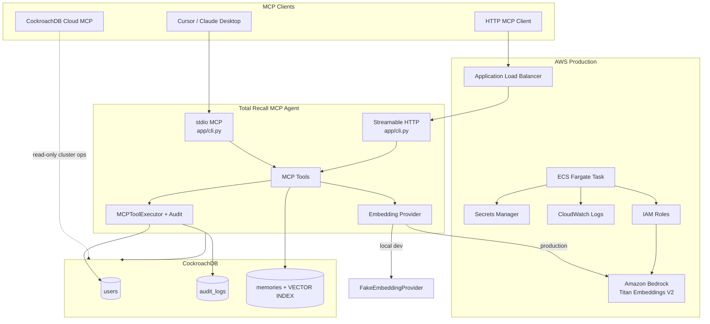

# Total Recall MCP — CockroachDB × AWS Hackathon

**Build the Future of Agentic Memory**
Hackathon: [cockroachdb-ai.devpost.com](https://cockroachdb-ai.devpost.com)

This repository contains **Total Recall MCP** (`total-recall-mcp-agent/`), an MCP (Model Context Protocol) agent that gives AI assistants durable, queryable memory backed by CockroachDB and production-ready AWS infrastructure.

The agent treats the database as the source of truth: every tool invocation is audited in a transaction, user context is scoped per principal, and semantic memories are stored with vector embeddings for similarity search across a distributed CockroachDB cluster.

---

## What this project does

AI agents forget context between sessions. Total Recall MCP solves that by exposing memory tools over MCP so Cursor, Claude Desktop, or any MCP client can:

1. **Remember** facts, preferences, and notes as structured semantic memory
2. **Recall** relevant memories via cosine vector search
3. **Audit** every tool call for traceability and debugging
4. **Resolve users** from persistent identity records

Memory is not ephemeral prompt context — it lives in CockroachDB with a distributed vector index, survives restarts, and scales with the cluster.

---

## Architecture



### Request flow (remember / recall)

1. MCP client invokes `remember_memory` or `recall_memory`
2. `MCPToolExecutor` opens a CockroachDB session and writes an `audit_logs` row (`STARTED`)
3. Text is embedded (Bedrock in AWS, deterministic fake vectors locally)
4. `MemoryRepository` inserts or searches the `memories` table using the **distributed vector index**
5. Transaction commits; audit row records success or failure

---

## Setup

**Prerequisites:** Python 3.14+, [uv](https://docs.astral.sh/uv/), Docker or Podman (for local CockroachDB).

```bash
cd total-recall-mcp-agent
cp app/.env.example .env
uv sync
docker compose up -d
uv run alembic upgrade head
uv run python scripts/seed_memories.py    # optional demo data
uv run total-recall-mcp-agent             # stdio MCP for Cursor / Claude Desktop
```

```bash
# Verify the memory tools end-to-end
chmod +x scripts/demo_memory.sh
./scripts/demo_memory.sh

# Run tests
uv run pytest
```

This gets you a local, unauthenticated stdio server backed by a local CockroachDB. For HTTP mode, CockroachDB Cloud setup, AWS deployment, authentication modes, and everything CockroachDB/AWS-specific, see the full guide:

**→ [`total-recall-mcp-agent/README.md`](total-recall-mcp-agent/README.md)**

---

## Application structure

```
total-recall-mcp-agent/          # repo root
└── total-recall-mcp-agent/      # the MCP agent project
    ├── app/
    │   ├── cli.py              # MCP entry: stdio (default) or --transport streamable-http
    │   ├── bootstrap.py        # Single tool-registration path
    │   ├── tools/              # MCP tool handlers (health, users, memory)
    │   ├── mcp/                # Registry, bridge, executor, server (/health route)
    │   ├── services/           # MemoryService (embed + persist/search)
    │   ├── repositories/       # MemoryRepository, AuditRepository
    │   ├── database/models/    # User, AuditLog, Memory (VECTOR column)
    │   └── clients/            # Bedrock + embedding providers
    ├── migrations/             # Alembic schema (users, audit_logs, memories + vector index)
    ├── terraform/              # AWS ECS Fargate dev stack
    ├── scripts/                # seed, demo, ccloud, skills install helpers
    ├── .agents/skills/         # CockroachDB Agent Skills + project skill
    ├── tests/                  # pytest (memory service + MCP integration)
    ├── docker-compose.yml      # Local CockroachDB + optional mcp-agent service
    └── Dockerfile              # Container image for ECS / Compose
```

---

## Hackathon compliance summary

| Requirement | Status |
|---|---|
| ≥2 CockroachDB hackathon tools | ✅ Vector Indexing, Cloud MCP, ccloud CLI, Agent Skills |
| ≥1 AWS service | ✅ Amazon Bedrock + Amazon ECS (Fargate), plus ALB, Secrets Manager, CloudWatch, IAM |
| Agentic memory use case | ✅ Semantic remember/recall with audit trail and per-user scoping |
| Working MCP integration | ✅ stdio (Cursor) + Streamable HTTP (Docker/ECS) |

Full breakdown of which CockroachDB components, AWS services, and Agent Skills are used, and where, is in the [sub-project README](total-recall-mcp-agent/README.md#cockroachdb-components) — the summary above is for judges scanning quickly.

---

## Submission narrative (for Devpost)

> **Total Recall MCP** gives AI agents durable memory through CockroachDB. Semantic memories are embedded with **Amazon Bedrock** (Titan v2), stored in a `memories` table with a **distributed vector index**, and recalled via cosine similarity — all scoped per caller and fully audited. In production the agent runs on **Amazon ECS Fargate** behind an ALB. Developers use stdio MCP in Cursor, inspect clusters via the **Cloud Managed MCP Server**, automate ops with the **ccloud CLI**, and apply **CockroachDB Agent Skills** for schema, transaction, and health expertise.

**CockroachDB tools used:** Distributed Vector Indexing · Cloud Managed MCP Server · ccloud CLI · Agent Skills
**AWS services used:** Amazon Bedrock · Amazon ECS Fargate · ALB · Secrets Manager · CloudWatch Logs · IAM

---

## Contributors

- Gaurav Kanojia

## License

MIT — see [LICENSE](LICENSE)
