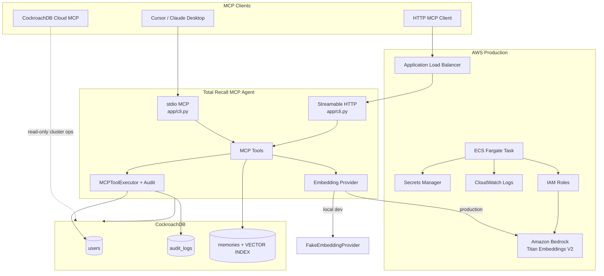

# Total Recall MCP — CockroachDB × AWS Hackathon

**Build the Future of Agentic Memory**
Hackathon: [cockroachdb-ai.devpost.com](https://cockroachdb-ai.devpost.com)

This repository contains **Total Recall MCP** (`total-recall-mcp-agent/`), an MCP (Model Context Protocol) agent that gives AI assistants durable, queryable memory backed by CockroachDB and production-ready AWS infrastructure.

The agent treats the database as the source of truth: every tool invocation is audited in a transaction, user context is scoped per principal, and semantic memories are stored with vector embeddings for similarity search across a distributed CockroachDB cluster.

**→ For project setup, running locally, testing, AWS deployment, and validating the live deployment, see [`total-recall-mcp-agent/README.md`](total-recall-mcp-agent/README.md).**

---

## What this project does

AI agents forget context between sessions. Total Recall MCP solves that by exposing memory tools over MCP so Cursor, Claude Desktop, or any MCP client can:

1. **Remember** facts, preferences, and notes as structured semantic memory
2. **Recall** relevant memories via cosine vector search
3. **Audit** every tool call for traceability and debugging
4. **Resolve users** from persistent identity records

Memory is not ephemeral prompt context — it lives in CockroachDB with a distributed vector index, survives restarts, and scales with the cluster.

---

## Architecture

### Request flow (remember / recall)

1. MCP client invokes `remember_memory` or `recall_memory`
2. `MCPToolExecutor` opens a CockroachDB session and writes an `audit_logs` row (`STARTED`)
3. Text is embedded (Bedrock in AWS, deterministic fake vectors locally)
4. `MemoryRepository` inserts or searches the `memories` table using the **distributed vector index**
5. Transaction commits; audit row records success or failure

---

## Hackathon compliance summary

| Requirement | Status |
|---|---|
| ≥2 CockroachDB hackathon tools | ✅ Vector Indexing, Cloud MCP, ccloud CLI, Agent Skills |
| ≥1 AWS service | ✅ Amazon Bedrock + Amazon ECS (Fargate), plus ALB, Secrets Manager, CloudWatch, IAM |
| Agentic memory use case | ✅ Semantic remember/recall with audit trail and per-user scoping |
| Working MCP integration | ✅ stdio (Cursor) + Streamable HTTP (Docker/ECS) |

Full breakdown of which CockroachDB components, AWS services, and Agent Skills are used, and where, is in the [sub-project README](total-recall-mcp-agent/README.md#cockroachdb-components) — the summary above is for judges scanning quickly.

---

## Contributors

- Gaurav Kanojia
- Shipra Yadav

## License

MIT — see [LICENSE](LICENSE)
